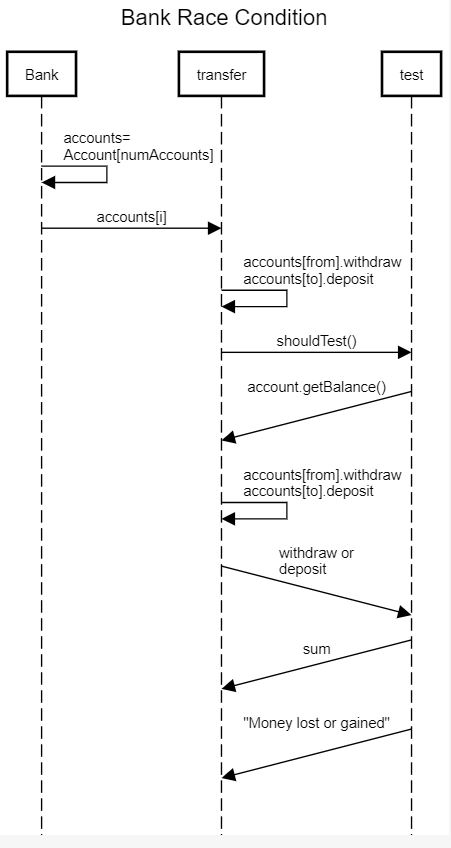

# BankSim

## Task 1

When ran, BankSim simulates the transactions of 10 accounts whose total initial balances equals 10,000 each. So 10 accounts with 10,000 each would give a total bank balance of 100,000. Throughout the simulation, money can be withdrawn from one account and be deposited into another account. The simulation ends when the total balance does not equal 100,000, indicating that money has somehow been gained or lost.

The major race condition that inhibits the successful execution of the Bank can be found in the transfer function which calls the test function. While withdrawing an amount from one account and depositing the same amount to another account, BankSim encounters a problem when multiple threads try to modify data simultaneously. Since multiple accounts will be accessing Bank at the same time, this can create a problem where the accounts can disrupt the transfer process by accessing funds before or after their designated time, resulting in funds being lost or gained from the total balance of 100,000, thus leading to BankSim closing.

## Task 2

Synchronized locks does not offer any mechanism of waiting queue in which after the execution of one thread any thread running in parallel can acquire the lock. Due to which the thread which is there in the system and running for a longer period of time never gets chance to access the shared resource thus leading to starvation.

Reentrant locks are very much flexible and has a fairness policy in which if a thread is waiting for a longer time and after the completion of the currently executing thread we can make sure that the longer waiting thread gets the chance of accessing the shared resource hereby decreasing the throughput of the system and making it more time consuming.

## Task 3

The second race condition is that a thread was used to sum up all the funds while other threads were simultaenously still transferring funds. This race condition was solved by refactoring the Bank class so that the testing method occurs on a separate thread from the transfer thread. Mutual exclusion was implemented between the testing thread and the transferring thread. The testing thread acquires the semaphore, sums up the total balances of all of the accounts, then releases the semaphore and signals to the other (transfer) threads.

## Task 4

The default implementation--while functional--is a poor solution in a multithreading environment because while a transfer between between two Accounts cannot occur if the requested withdrawal by the ‘to’ Account exceeds the balance within the ‘from’ Account, there is no indication for the transfer thread to wait for available funds, thus creating chaos within the transfers and ruining a cycle of clean multithreading in which the threads execute uniformly. 
 
## Task 5

This deadlock condition is caused by the fact that there is nothing telling BankSim to terminate so it will stay running even though it has reached the predefined number of transfers. To get rid of this deadlock condition, an implementation must be created which notifies BankSim that it has executed the predefined number of transfers and that it is safe to terminate.  

### Requirements

The purpose of this assignment was to use multithreading to eliminate race conditions and build a functioning BankSim.
We implemented everything that was detailed in the instructions for this assignment. The following is what was implemented for each task:

Task 1: Provide a brief technical overview of the project, explain the major race condition that inhibits the successful execution of the Bank, and draw a UML sequence diagram which outlines the major race condition.

Task 2: Implement either Synchronized Methods, Synchronized Code Blocks, or ReentrantLock to resolve the race condition discovered in Task 1.

Task 3: Refactor the Bank class such that the testing method occurs on a separate thread from the transfer thread and implement mutual exclusion between the testing thread and the transferring thread. 

Task 4: Implement a wait/notify solution to defer any invalid transfers until the ‘from’ Account’s balance exceeds the requested amount.

Task 5: Implement a solution to the deadlock condition that blocks the successful termination of the BankSim after the simulation has reached the predefined number of transfers.

### Team Work

We collaborated by staying in regular contact with each other over the entire two-week span of this assignment. We would text in order to coordinate which tasks we were doing but the bulk of our collaboration took place on Discord. Discord has a feature which allows you to share your screen while on call with others and that proved to be very useful when we would both be working on the assignment from home. Saad completed Tasks 1, 3, and 5 while Dawud completed tasks 2 and 4. We were both responsible for completing our respective Task explanations which are listed in the first half of this README.md. Saad completed the Requirements portion and Dawud completed Team Work and the UML sequence diagram that explains how the test() method call is invoked after Task 3. Neither of us was too fast or too slow for the other since we both worked at an even pace that we ensured we maintained throughout the duration of the assignment. We both took part in the writing and we both revised each other's work (whenever necessary) during our calls on Discord when we would be reviewing each other's code. 

